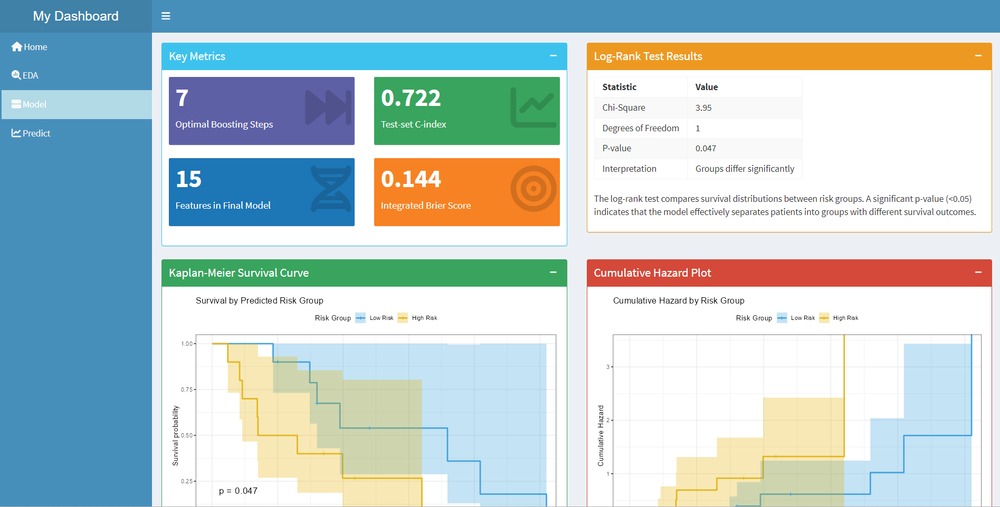

# 🧬 Pancreatic Cancer Survival Prediction Tool

This Shiny application provides **personalized survival predictions** for pancreatic cancer patients based on tumor gene expression data. The tool integrates random survival forest–based feature selection with a **CoxBoost survival model**, offering interpretability and clinical relevance for precision oncology.

Built using high-throughput GEO datasets, the app enables users to explore survival-associated expression trends, inspect model diagnostics, and predict patient-specific survival curves interactively.



---

## 🚀 Features

- 📊 **Exploratory Data Analysis (EDA)**
  - PCA plots, gene heatmaps, and volcano plots for survival-associated expression
  - Dynamic visualisation of group-level gene trends

- 🧠 **Model Training & Evaluation**
  - Feature selection via **Random Survival Forests (RSF)**
  - Hyperparameter-tuned **CoxBoost** survival model
  - Performance metrics: C-index, Integrated Brier Score (IBS), ROC curves

- 🔮 **Patient-Specific Risk Prediction**
  Upload a `.csv` file of expression values to generate:
  - Risk Score (linear predictor)
  - Predicted Survival Curve
  - Risk Group (High/Low)
  - Estimated Median Survival
  - Top Contributing Genes
  - Risk Percentile Visualization
  - Gene Expression Radar Chart

---

## 📁 Project Structure

```
.
├── app.R                       # Main Shiny app launcher and model loader
├── environment_image.RData    # Serialized environment including CoxBoost model
├── assets/                    # Screenshots and image assets
├── GEO_data/                  # Auto-downloaded and cached GEO datasets
├── patient_data/              # Demo CSV files for patient input
└── src/
    ├── eda.R                  # Exploratory data analysis
    ├── global.R               # Load libraries and define global variables
    ├── load_data.R            # GEO data loading & preprocessing
    ├── model.R                # Model building using CoxBoost
    ├── server/                # Shiny server logic and helpers
    └── ui/                    # Modular Shiny UI components
```

---

## 📥 Input Format

To generate a prediction, upload a `.csv` file with two columns:

```csv
gene_id,expression
7896736,3.3944
1234567,2.9102
...
```

- `gene_id`: Unique gene identifier (must match those used in the model)
- `expression`: Normalized expression value  
- **Note**: Any extra columns beyond the first two will be ignored.

---

## ⚙️ Installation & Usage

1. Clone the repository:

```bash
git clone https://github.com/BobDylanSamsung/DATA3888.git
cd DATA3888
```

2. Install required R packages:

```r
install.packages(c(
  "caret", "CoxBoost", "dplyr", "DT", "future", "fmsb", "GEOquery", "ggplot2",
  "ggfortify", "glmnet", "ggrepel", "Hmisc", "knitr", "limma", "pheatmap",
  "promises", "randomForestSRC", "pec", "pROC", "prodlim", "RColorBrewer",
  "riskRegression", "rms", "reshape2", "shiny", "shinycssloaders",
  "shinydashboard", "survival", "survminer", "tidyverse", "timeROC", "fresh"
))
```

3. Run the app locally:

```r
shiny::runApp()
```

- On first run, the app:
  - Downloads GEO data (`GSE28735`, `GSE62452`)
  - Runs EDA, feature selection, and model training
  - Caches the trained model in `environment_image.RData` for faster future launches

---

## 🧪 Model Details

- **Model**: CoxBoost (Boosted Cox Proportional Hazards)
- **Feature Selection**: Random Survival Forests (Minimal Depth)
- **Hyperparameter Tuning**: Performed offline and fixed in pipeline
- **Validation**: Train/validation/test split with external holdout
- **Metrics**: C-index, Integrated Brier Score (IBS), ROC/AUC

---

## 📊 Datasets Used

- [GSE28735](https://www.ncbi.nlm.nih.gov/geo/query/acc.cgi?acc=GSE28735) – Paired tumor and non-tumor samples
- [GSE62452](https://www.ncbi.nlm.nih.gov/geo/query/acc.cgi?acc=GSE62452) – Pancreatic ductal adenocarcinoma samples

> These datasets are downloaded and cached on first run using the `GEOquery` package.

---

## 🖥️ App Structure

The app consists of 4 main tabs:

1. **Home** – Overview of the project and team
2. **EDA** – Visual exploration of expression patterns and survival-linked features
3. **Model** – Summary of model performance metrics, feature importance, and evaluation plots
4. **Predict** – Upload new patient data to obtain personalized survival predictions

---

## 👥 Contributors

This application was developed by the **BIOMED 8** team:

- **Dylan**: Mathematics and Computer Science
- **Howard**: Data Science
- **Shuhan**: Data Science
- **Cherry**: Finance and Data Science
- **Ashley**: Data Science
- **Zhantao**: Data Science and Financial Mathematics

---

## 🧪 Notes

- The app is currently designed for **local use only**.
- For external deployment (e.g., [shinyapps.io](https://shinyapps.io), Docker), additional configuration is required.
- Predictions are illustrative only and not intended for clinical use without validation.

---
